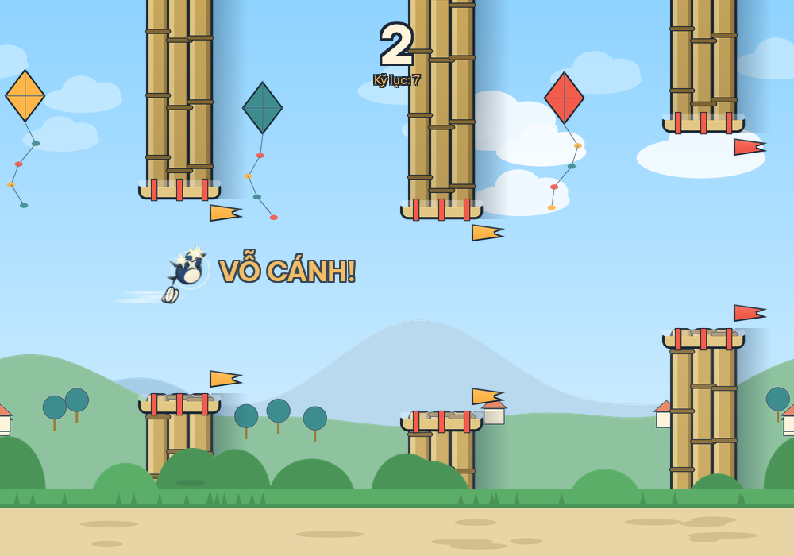
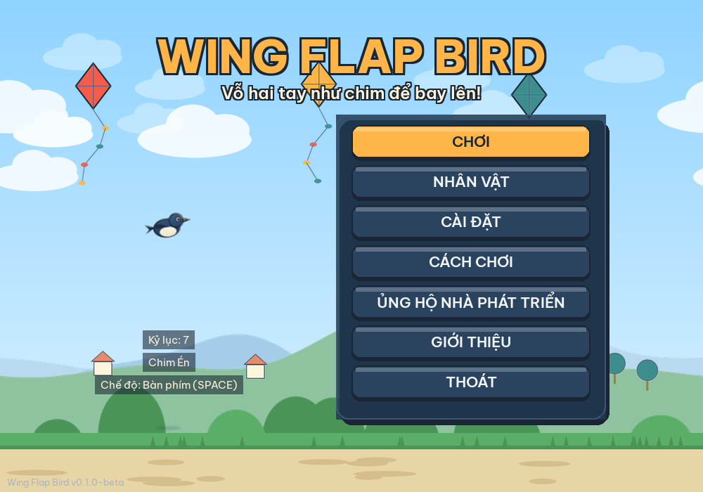
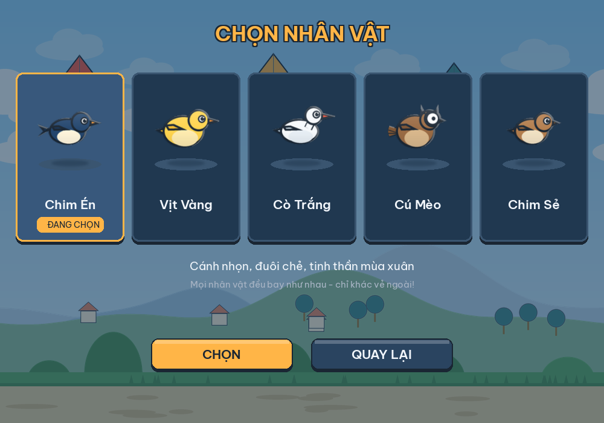
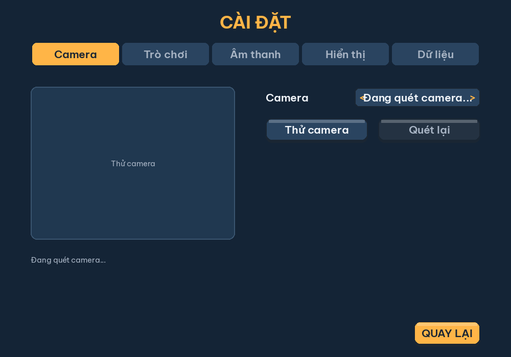
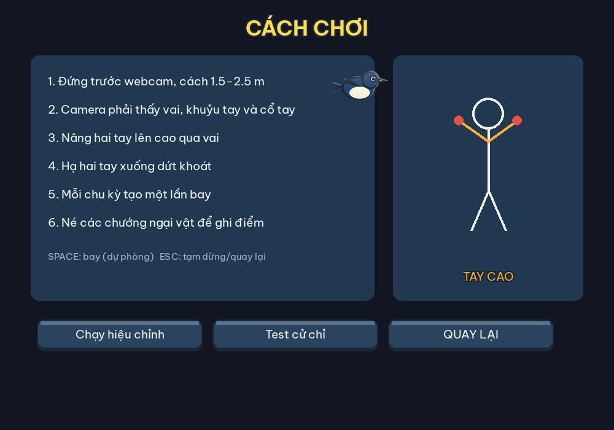
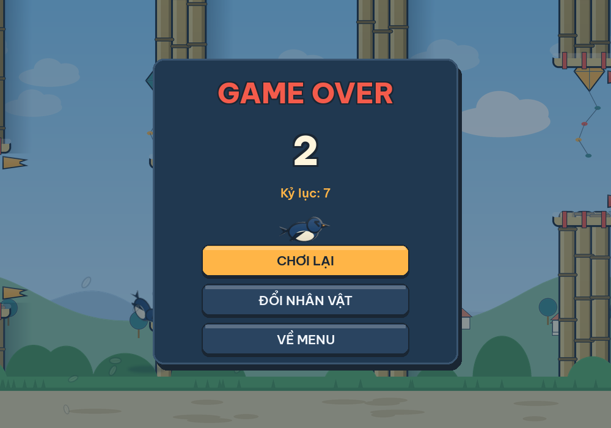

# 🐦 Wing Flap Bird

<p align="center">
  
</p>

**Vỗ hai tay như chim trước webcam để bay!** Game né chướng ngại vật 2.5D
điều khiển bằng chuyển động cơ thể (MediaPipe Pose), art direction
*Wind Festival Sky*, chạy hoàn toàn offline trên Windows.

> Trò chơi độc lập lấy cảm hứng từ thể loại né chướng ngại vật — toàn bộ
> đồ họa và âm thanh tự tạo, không dùng asset của game thương mại nào.

*All screenshots were captured from the running Pygame build.*

## 🐤 Năm nhân vật — miễn phí từ đầu

**Chim Én · Vịt Vàng · Cò Trắng · Cú Mèo · Chim Sẻ** — mọi nhân vật dùng
cùng hitbox và vật lý (chỉ khác vẻ ngoài và animation). Không khóa,
không trả phí, không lợi thế gameplay.

## Download

1. Mở trang **[Releases](https://github.com/hoaikhoitran/wing-flap-bird/releases)**
2. Tải `WingFlapBird-v0.1.0-beta-Windows-x64.zip`
3. Giải nén
4. Mở `WingFlapBird.exe`

Không cần cài Python, không cần Internet, không cần terminal.

> ⚠️ **Windows SmartScreen**: bản beta chưa có chứng chỉ ký mã nên Windows
> có thể cảnh báo. Chọn *More info → Run anyway*. Chỉ tải game từ trang
> GitHub Releases chính thức của repository này.

## How to play

1. Đứng cách webcam **1.5–2.5 m**, camera thấy được vai, khuỷu tay, cổ tay.
2. Lần đầu chơi, game hiệu chỉnh nhanh ~5 giây (kết quả được lưu lại).
3. **Nâng hai tay qua vai rồi hạ xuống dứt khoát** = một lần vỗ cánh
   (~100 px). Mỗi chu kỳ chỉ tính một lần vỗ.
4. Né các **cổng tre** để ghi điểm. Menu **CÁCH CHƠI** có minh họa động
   và chế độ test cử chỉ trực tiếp.

## Webcam privacy

Hình ảnh webcam được **xử lý cục bộ 100%** (model MediaPipe đóng gói sẵn).
Game không ghi hình, không lưu video, không gửi dữ liệu lên Internet,
không telemetry. Chơi không cần camera bằng phím `SPACE`; khung webcam
preview tắt được trong Cài đặt. Chi tiết: **[PRIVACY.md](PRIVACY.md)**.

## Controls

| Phím / Động tác | Chức năng |
|---|---|
| **Vỗ hai tay** | Bay lên (điều khiển chính) |
| `SPACE` | Bay (dự phòng khi không có webcam) |
| `ESC` | Tạm dừng / quay lại |
| `R` / `M` | Chơi lại / Về menu (màn game over) |
| Chuột / `↑↓←→` `Enter` | Điều hướng menu |
| `F1` | Debug overlay |

## Screenshots

| Main menu | Character selection |
|---|---|
|  |  |

| Settings | How to play |
|---|---|
|  |  |

| Game over |
|---|
|  |

## System requirements

- Windows 10/11 x64
- Webcam (tùy chọn — không có vẫn chơi được bằng bàn phím)
- CPU 4 nhân trở lên khuyến nghị (MediaPipe chạy bằng CPU)
- ~700 MB dung lượng trống

## Support

Wing Flap Bird miễn phí. Nếu thích game, bạn có thể ủng hộ qua menu
**ỦNG HỘ NHÀ PHÁT TRIỂN** trong game (quét VietQR) — hoàn toàn tự nguyện,
không mở khóa lợi thế. Trang giới thiệu:
[hoaikhoitran.github.io/wing-flap-bird](https://hoaikhoitran.github.io/wing-flap-bird/)
*(bật GitHub Pages từ thư mục `/docs`)*.

## Build from source (developer)

Yêu cầu **Python 3.11 x64** (MediaPipe chưa hỗ trợ 3.13).

```bash
git clone https://github.com/hoaikhoitran/wing-flap-bird.git
cd wing-flap-bird
python -m venv .venv
.venv\Scripts\activate
pip install -r requirements-dev.txt
python main.py            # chạy game
pytest                    # 91 test
```

Tham số: `--camera N`, `--no-camera`, `--debug`, `--smoke`,
`--capture-readme --output docs/screenshots` (chụp screenshot bằng chính
renderer của game).

Sinh lại asset (deterministic):

```bash
python scripts/generate_game_assets.py --seed 20260715
python scripts/generate_audio_assets.py
```

Build bản Windows:

```bash
scripts\build_windows.bat
```

Kết quả: `dist/WingFlapBird/WingFlapBird.exe` và
`release/WingFlapBird-v0.1.0-beta-Windows-x64.zip`.

## License

[MIT](LICENSE) © 2026 hoaikhoitran — asset art/audio tự sinh phát hành MIT
cùng repo (xem [assets/ASSET_MANIFEST.md](assets/ASSET_MANIFEST.md)).
Font **Be Vietnam Pro** (SIL OFL 1.1) và các thành phần khác:
[THIRD_PARTY_NOTICES.md](THIRD_PARTY_NOTICES.md).
